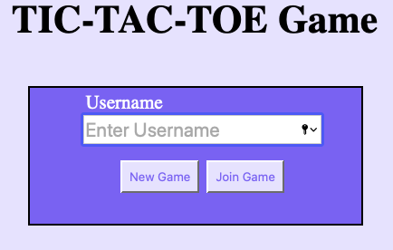
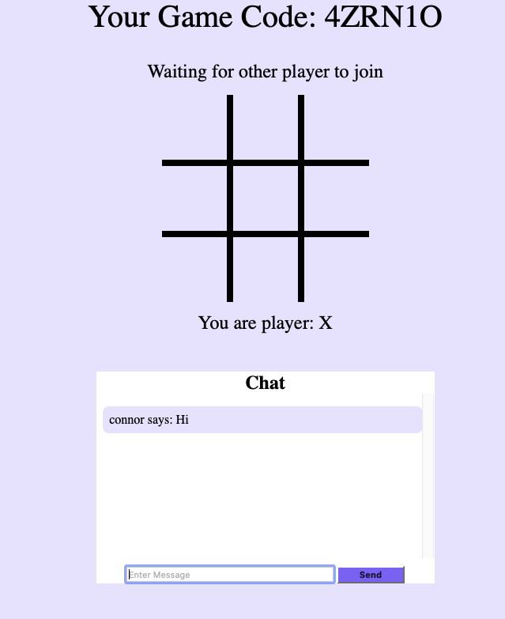

# TicTacToe Full Stack Web Application

## Description
Multiplayer tic-tac-toe game with a chat; developed using Node.js, Express.js, and Socket.io. Allows players to create and join a tic-toe-game on the web by using a unique game code.

Link: https://tic-tac-toe-game.azurewebsites.net

Note: The website has run out of resources using the free tier of Azure so it is currently unavailable.

 

    
  

